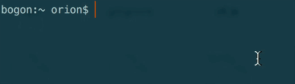

tang-poems[](https://travis-ci.org/carrie999/poems)
===============


Uses the API from this great article on [今日诗词API](https://www.sqyai.com/post-762.html).<br>
Feel free to make a PR to add!

Ensure you have [Node.js](https://nodejs.org) version 8 or higher installed. Then run the following:
### Install
```
npm install tang-poems -g   or  npm install tang-poems 
```


### Usage --global  
```
$ poem --help
	Usage
	    $ poem [options]

	Examples
		$ poem 
		不知江月待何人，但见长江送流水。

	Options
	  --all -a     Show all the poems content  //展示全部文章
```

### Usage local
```
const poem = require('tang-poems')
poem()
不知江月待何人，但见长江送流水。
```

## License

MIT © [Carrie999](https://github.com/Carrie999)
